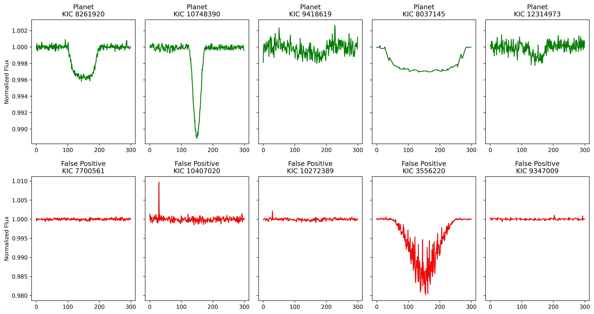
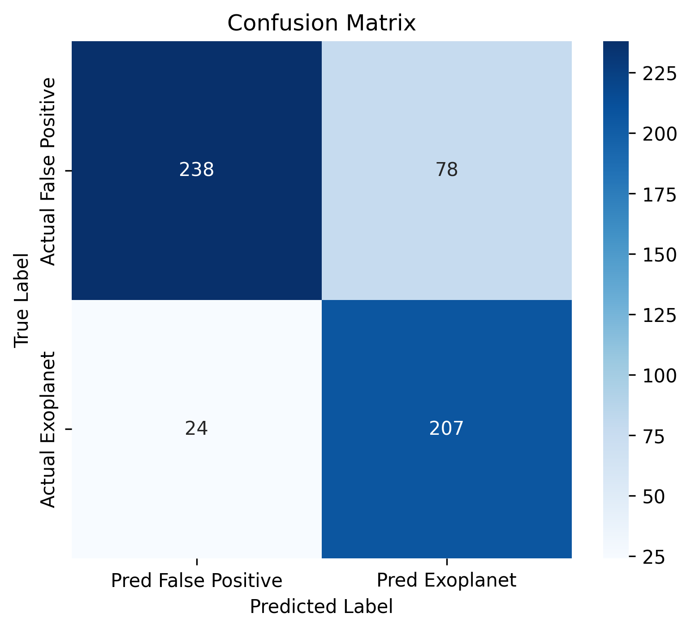
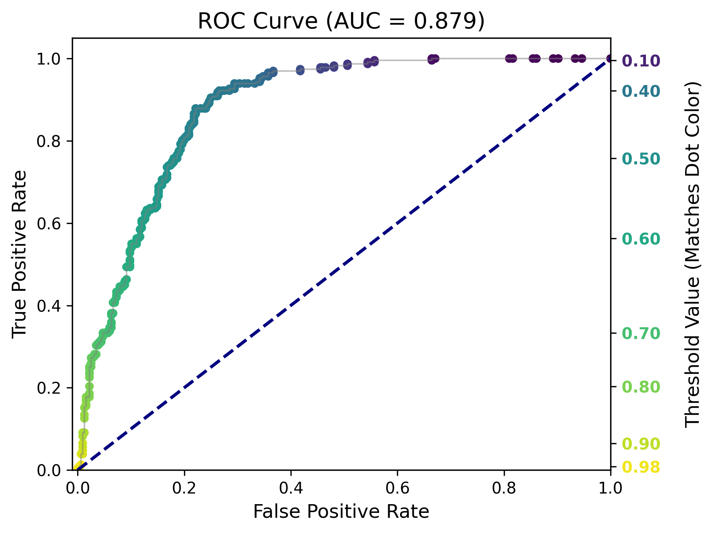
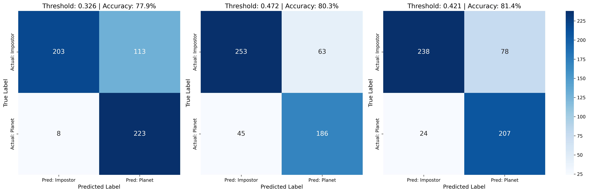
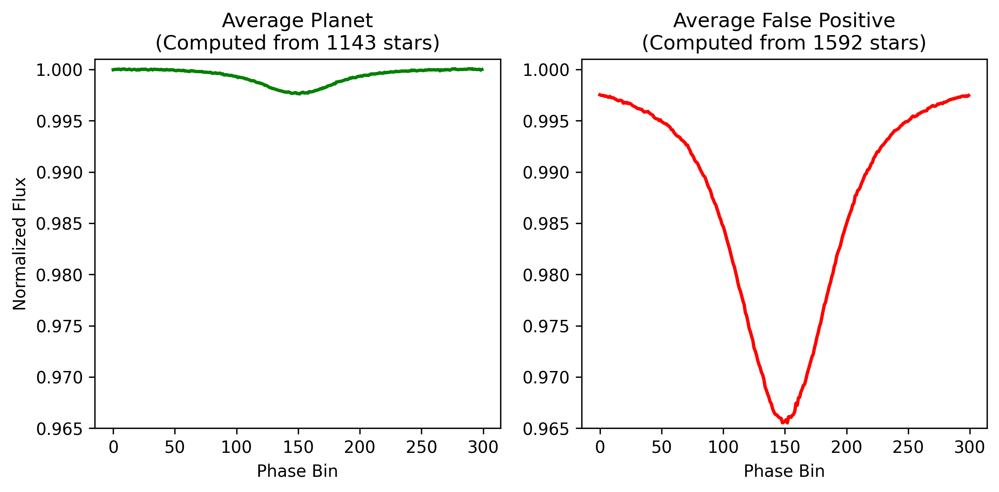
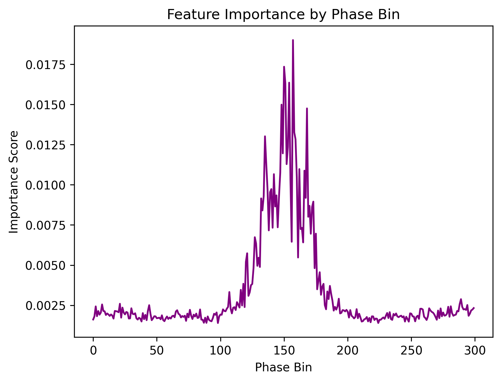
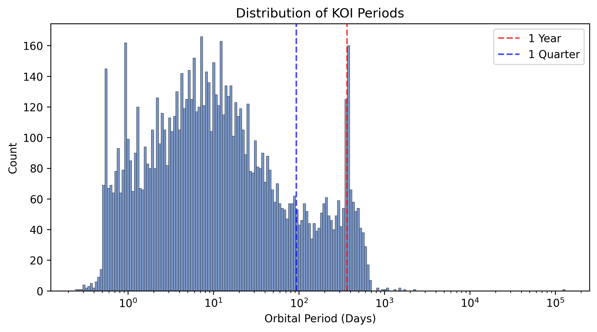
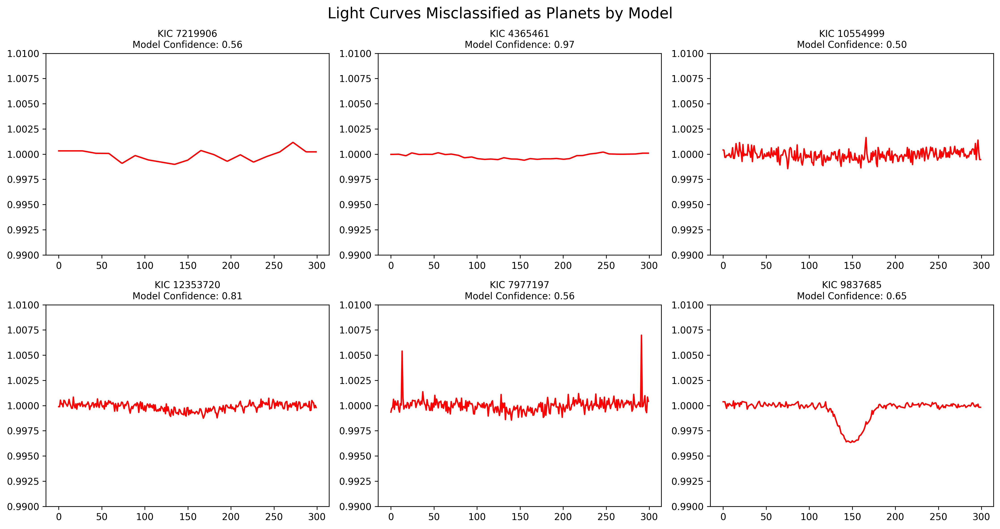

# Kepler Exoplanet Classifier
Locating exoplanet transits by classifying Kepler light curves using a Random Forest machine learning model.

## Project Overview
The Kepler Space Telescope identified thousands of objects of interest (KOIs) by identifying periodic dips in luminosity of stars. Many of these dips are caused by exoplanets transiting in front of their star; however, statistical noise or other astronomical events such as eclipsing binary stars can produce false positives. 

<p align="center">

</p>

This project builds a Random Forest Classifier to analyze the light curves of KOI candidate stars. By analyzing the shape of the transit, the model predicts whether a given signal is a likely exoplanet or a false positive.

## Data Collection and Processing
The list of candidate stars was sourced via the NASA Exoplanet Archive API, and the corresponding light curves from the Kepler mission were downloaded using the `lightkurve` package.

The candidate stars were filtered by their transit depth. Only stars that had a transit above a minimum threshold, 500 ppm, were included in the training data. This allowed cleaner data to be analyzed.

Each remaining light curve was stitched together, flattened, and folded over the orbital period. Folding the light curve stacks all observed transits on top of each other, creating a profile of a single event. The light curve was cropped to a small section around the transit, partitioned into 300 phase bins, and normalized to allow a consistent input for the model.

## Model Training
A Random Forest Classifier uses a large number of decision trees to generate a consensus prediction. By aggregating the votes of individual trees, the model reduces the risk of overfitting and improves general accuracy compared to a single decision tree. The model uses `class_weight - 'balanced'` to mitigate scenarios where the number of false positives outnumber confirmed planets in the data set and the model guesses false positive for every light curve to achieve a high accuracy.

Using the `sklearn` package, the processed light curves were fed into a random forest classifier with 1,000 decision trees.

## Results
The result was a model with 81.35% accuracy. The classification report and confusion matrix are below. 

<p align="center">

</p>

Classification Report:

| Class | Precision | Recall | F1-Score | Support |
| :--- | :---: | :---: | :---: | :---: |
| **False Positive** | 0.91 | 0.75 | 0.82 | 316 |
| **Planet** | 0.73 | 0.90 | 0.80 | 231 |
| | | | | |
| **Accuracy** | | | **0.81** | **547** |
| **Macro Avg** | 0.82 | 0.82 | 0.81 | 547 |
| **Weighted Avg** | 0.83 | 0.81 | 0.81 | 547 |

The model achieves a recall of 0.90 for the planets class, indicating that it successfully identifies 90% of confirmed exoplanets. However, this comes at the expense of a lower precision, meaning some false positives are misclassified as planets. Further analysis of the model's performance can be done by examining its ROC curve.

<p align="center">

</p>

This graph shows the tradeoff between the false positive rate and the true positive rate of the model. The right-hand axis indicates the probability threshold required to achieve that performance point. Tick labels are color-coded to match the corresponding points on the ROC curve. The area under the curve (AUC) gives an overall grade for how good a model is. It is a better benchmark than model accuracy, which changes based on the threshold values. A value of 0.879 indicates a strong model.

The following graph illustrates how changing the threshold values alters the model accuracy by plotting confusion matrices for three different threshold values.

<p align="center">

</p>
This furthers the idea that depending on the probability threshold of the model, it will locate more planets at the expense of increasing its false positive rate, or it can limit the amount of false positives, but that comes at the expense of locating confirmed targets.


## Supplemental Graphs

<p align="center">

</p>
This plots the average light curves for the identified planets and false positives. This helps shed some light on the differences the model noticed. The false positives tend to have a much steeper and larger dip than the planets.

<p align="center">

</p>
This graph illustrates what points of the light curve were seen as more important by the training model. This shows that the points closer to the center had a larger influence on determining the classification of the light curve. This makes sense as it is where the transit actually occurs and illustrates the model's ability to identify transit dips.

<p align="center">

</p>
This plots the periods of every object in the KOI catalog on a log scale with vertical lines denoting 1 quarter and 1 year respectively. For a given timeframe, objects with shorter periods have more transits occur, allowing more data to be folded and combined, increasing their signal-to-noise ratio. Seeing the distribtuion of periods helped determine how many quarters the light curves could be downloaded for and still contain enough information.

<p align="center">

</p>
Here are some light curves that were misidentified by the training model.

## Instructions to Run
1.  Clone the repository:
    ```bash
    git clone https://github.com/Singh-Mehtab/exoplanet-transit-classifier.git
    ```
2.  Install dependencies:
    ```bash
    pip install -r requirements.txt
    ```
3.  Run the notebook:
    Open `notebooks/Exoplanet_Classifier_Final.ipynb` and run all cells.

A sample data file is already included in the repository under `data/planet_data_n2000_d500_Q1-2-3-4_z0.2_p300.npz`. Instructions to change the filters to download your own set of data are included in the Jupyter Notebook.
